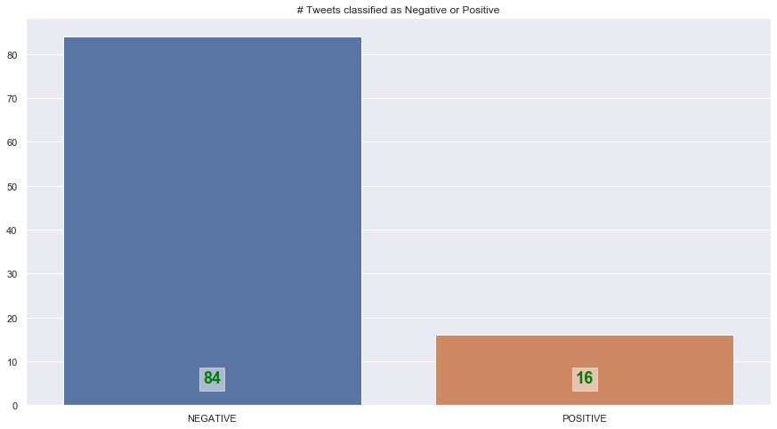

# Prospero

Prospero crawls `Engadget` and `Twitter` for posts related to `PS5` and show the results in a simple webpage.

## How it works

Prospero consists of different parts for doing various tasks. It uses `Selenium` and `Chrome Driver` for crawling `Engadget`. For `Twitter`, instead of using its official API, or using a similar technique for crawling `Engadget`, I opted to use `Twins`. `Twins` is one of the most advanced Twitter crawlers, yet lots of people don't know about it. Here are different libraries used in building Prospero:

1. [Selenium](https://selenium-python.readthedocs.io/)
1. [Twint](https://github.com/twintproject/twint)
1. [Flask](https://flask.palletsprojects.com/en/1.1.x/)
1. [Word Cloud](https://github.com/amueller/word_cloud)
1. [Huggingface Transformers](https://github.com/huggingface/transformers)

## Sentiment Analysis

Sentiment analysis is done with the Huggingface Transformers libraries, without any re-training, transfer learning, or fine-tuning. The results can be very wrong in some cases. Here are a plot showing the sentiment ratio for 100 randomly chosen tweets:

